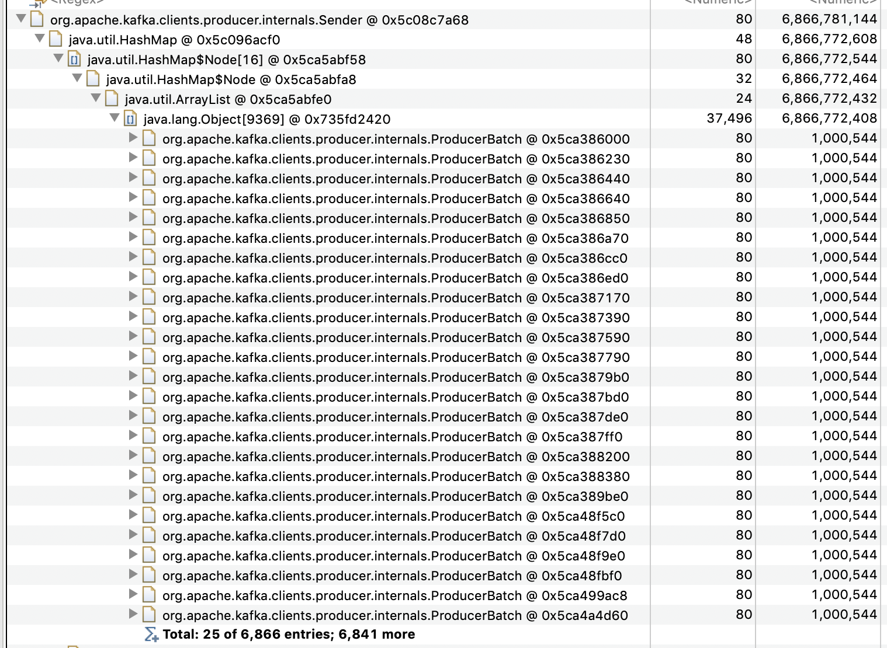

I was trying to create a small codebase that would replicate https://issues.apache.org/jira/browse/KAFKA-8325.
I wasn't able to replicate that, but did observe that with a mismatch between the producer `batch.size` and the broker 
`message.max.bytes`, that the producer would throw an OutOfMemoryError.

The mismatch was that I had a larger `batch.size` than the broker `max.message.bytes`. From reading the docs, I thought
the producer `batch.size` was purely an optimisation for throughput, but perhaps it's used for more than that.

When running the code it outputs:
```
09:52:26.315 [kafka-producer-network-thread | producer-1] WARN  o.a.k.c.producer.internals.Sender - [Producer clientId=producer-1] Got error produce response in correlation id 4 on topic-partition maxwell.transactions-0, splitting and retrying (30 attempts left). Error: MESSAGE_TOO_LARGE
09:52:26.319 [kafka-producer-network-thread | producer-1] WARN  o.a.k.c.producer.internals.Sender - [Producer clientId=producer-1] Got error produce response in correlation id 5 on topic-partition maxwell.transactions-0, splitting and retrying (30 attempts left). Error: MESSAGE_TOO_LARGE
09:52:26.322 [kafka-producer-network-thread | producer-1] WARN  o.a.k.c.producer.internals.Sender - [Producer clientId=producer-1] Got error produce response in correlation id 6 on topic-partition maxwell.transactions-0, splitting and retrying (30 attempts left). Error: MESSAGE_TOO_LARGE
09:52:26.324 [kafka-producer-network-thread | producer-1] WARN  o.a.k.c.producer.internals.Sender - [Producer clientId=producer-1] Got error produce response in correlation id 7 on topic-partition maxwell.transactions-0, splitting and retrying (30 attempts left). Error: MESSAGE_TOO_LARGE
09:52:26.327 [kafka-producer-network-thread | producer-1] WARN  o.a.k.c.producer.internals.Sender - [Producer clientId=producer-1] Got error produce response in correlation id 8 on topic-partition maxwell.transactions-0, splitting and retrying (30 attempts left). Error: MESSAGE_TOO_LARGE
```

Firstly, I'm not sure why the number of attempts is not decremented with each attempt.

Secondly, after retrying enough times, the program throws an OutOfMemoryError. Eclipse MAT shows the following:


I'm not saying this is a bug in it's own right, but the cause of this behaviour may somehow be related to 
https://issues.apache.org/jira/browse/KAFKA-8325 as I was playing with the variables I believe trigger that issue.

If you clone this project locally, you should be able to replicate with `sbt run`.

Thanks for considering.
